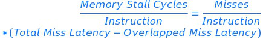
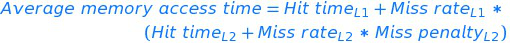
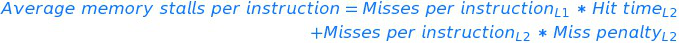

<!-- MDTOC maxdepth:6 firsth1:1 numbering:0 flatten:0 bullets:1 updateOnSave:1 -->

   - [Memory hierarchy](#memory-hierarchy)   
      - [1. Incentive of using memory hierarchy](#1-incentive-of-using-memory-hierarchy)   
      - [2. Designers' target](#2-designers-target)   
      - [3. When to write cache data into memory](#3-when-to-write-cache-data-into-memory)   
      - [4. Categories of cache misses](#4-categories-of-cache-misses)   
      - [5. Relationship between miss rate and misses per instruction](#5-relationship-between-miss-rate-and-misses-per-instruction)   
      - [6. CPU execution time and cache misses](#6-cpu-execution-time-and-cache-misses)   
      - [7. Misses per instruction](#7-misses-per-instruction)   
      - [8. Pros and cons of Misses per instruction](#8-pros-and-cons-of-misses-per-instruction)   
      - [9. Basic questions about cache](#9-basic-questions-about-cache)   
      - [10. Average memory access time](#10-average-memory-access-time)   
      - [11. Average Memory Access Time and Processor performance](#11-average-memory-access-time-and-processor-performance)   
      - [12. Miss penalty and out-of-order execution processor](#12-miss-penalty-and-out-of-order-execution-processor)   
      - [13. Six Basic Cache Optimizations](#13-six-basic-cache-optimizations)   
      - [14 Summary of basic cache optimizations](#14-summary-of-basic-cache-optimizations)   

<!-- /MDTOC -->
## Memory hierarchy
### 1. Incentive of using memory hierarchy  
The increasing gap between the performance of CPU and memory
### 2. Designers' target
Traditionally, the average memory access time. For PMD, power efficiency is more important.
### 3. When to write cache data into memory
**Write through** VS **Write back**
### 4. Categories of cache misses
- Compulsory
- Capacity
- Conflict
- Coherency

### 5. Relationship between miss rate and misses per instruction

### 6. CPU execution time and cache misses

### 7. Misses per instruction
  
### 8. Pros and cons of Misses per instruction
- Pros: Independent of hardware implementation. Eg: Speculative fetch will decrease the miss rate if measured by misses per memory access
- Cons: Dependent on architecture. Hard to compare this index between different instruction sets.  

### 9. Basic questions about cache
- Block placement
  - Direct mapped
  - Fully associative
  - n-way Set associative
- Block identification
  - Tag bit
  - Valid bit
- Block replacement (strategies for set/fully associativity)
  - Random
  - LRU
  - FIFO (Pseudo FIFO)
- Write strategy
  - Difference from Read: The block can be read from the cache at the same time that the tag is read and compared
  - Options when writing to the cache:
    - Write-through:
      - Easier to implement
      - Simplifies data coherency
    - Write-back:
      - Use less bandwidth, so attractive to multi-processors
      - Saves power, attractive to embedded devices
    - dirty bit
  - Options when a write miss:
    - Write allocate (usually coupled with write-back)
    - No-write allocate (usually coupled with write-through)  

### 10. Average memory access time

### 11. Average Memory Access Time and Processor performance
- There are other reasons for CPU stall besides cache miss.
- Depending on the type of CPU. For the in-order execution CPU, the answer is yes.

   

### 12. Miss penalty and out-of-order execution processor

### 13. Six Basic Cache Optimizations
- First Optimization: Large Block size to reduce miss rate
  - Reduce Compulsory misses
  - Increase the miss penalty
  - Increase the conflict misses
  - Popular block size: 32 bytes for 4 KB & 64 bytes for larger cache
- Second Optimization: Larger cache to reduce the miss rate
- Third Optimization: Higher associativity to reduce miss rate
  - 2:1 Cache rule of thumb: a direct-mapped cache of size N has the same miss rate as a two-way set associative cache of size N/2
- Forth Optimization: Multilevel caches to reduce miss penalty
  - Question about cache: Should I make the cache faster to keep pace with the speed of processors, or make the cache larger to overcome the widening gap between the processor and main memory?
  - 
  - 
  - For second-level caches, there are many fewer hits than in the first-level cache, so the emphasis shifts to fewer misses. This insight leads to much larger caches and techniques to lower the miss rate, such as higher associativity and larger blocks.
- Fifth Optimization: Giving priority to read misses over writes to reduce miss penalty
  - To solve read-after-write data hazard.
  - Checks the contents of the write buffer on a read miss, and if there are no conflicts and the memory system is available, let the read miss continue.
- Sixth Optimization: Avoiding address translation during indexing of the cache to reduce hit time
  - Physical cache and virtual cache
  - Indexing the cache and comparing addresses with physical address or virtual address.
  - Pros and cons of full virtual addressing for both indices and tag:
    - Pros: Eliminates address translation time from a cache hit.
    - Cons:
      - Page protection
      - Cache is flushed after switching the process
      - OS and user programs may use two different virtual addresses for the same physical address. Hardware solutions called antialiasing guarantee every cache block a unique physical address. Software methods like page coloring can also make this problem easier to handle.
      - IO usually uses physical addresses and this would require mapping to virtual addresses to interact with a virtual cache.
   - virtually indexed and physically tagged. However, the limitation of this method is that a direct-mapped cache can be no bigger than the page size. If we introduce the associativity in this approach, a bigger cache will be allowed.

### 14 Summary of basic cache optimizations
Technique | Hit time | Miss penalty | Miss rate | Hardware complexity | comment
--- | --- | --- | --- | --- | --- |
Larger block size | |-|+|0|Trival;Pentium 4 uses it
Larger cache size | - | | + |1|Widely used, especially for L2 caches
Higher associativity |-||+|1|Widely used
Multilevel cache||+||2|Costly hardware; harder if L1 block size != L2 block size; widely used
Read priority over writes||+||1|Widely used
Avoiding address translation during cache indexing | +|||1|Widely used
