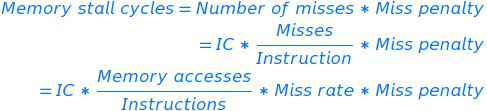
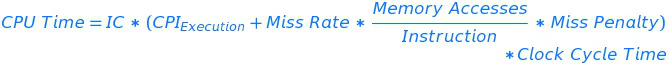

<!-- MDTOC maxdepth:6 firsth1:1 numbering:0 flatten:0 bullets:1 updateOnSave:1 -->

   - [Memory hierarchy](#memory-hierarchy)   
      - [1. Incentive of using memory hierarchy](#1-incentive-of-using-memory-hierarchy)   
      - [2. Designers' target](#2-designers-target)   
      - [3. When to write cache data into memory](#3-when-to-write-cache-data-into-memory)   
      - [4. Categories of cache misses](#4-categories-of-cache-misses)   
      - [5. Relationship between miss rate and misses per instruction](#5-relationship-between-miss-rate-and-misses-per-instruction)   
      - [6. CPU execution time and cache misses](#6-cpu-execution-time-and-cache-misses)   
      - [7. Misses per instruction](#7-misses-per-instruction)   
      - [8. Pros and cons of Misses per instruction](#8-pros-and-cons-of-misses-per-instruction)   
      - [9. Basic questions about cache](#9-basic-questions-about-cache)   
      - [10. Average memory access time](#10-average-memory-access-time)   
      - [11. Average Memory Access Time and Processor performance](#11-average-memory-access-time-and-processor-performance)   

<!-- /MDTOC -->
## Memory hierarchy
### 1. Incentive of using memory hierarchy  
The increasing gap between the performance of CPU and memory
### 2. Designers' target
Traditionally, the average memory access time. For PMD, power efficiency is more important.
### 3. When to write cache data into memory
**Write through** VS **Write back**
### 4. Categories of cache misses
- Compulsory
- Capacity
- Conflict
- Coherency

### 5. Relationship between miss rate and misses per instruction

### 6. CPU execution time and cache misses

### 7. Misses per instruction
  
### 8. Pros and cons of Misses per instruction
- Pros: Independent of hardware implementation. Eg: Speculative fetch will decrease the miss rate if measured by misses per memory access
- Cons: Dependent on architecture. Hard to compare this index between different instruction sets.  

### 9. Basic questions about cache
- Block placement
  - Direct mapped
  - Fully associative
  - n-way Set associative
- Block identification
  - Tag bit
  - Valid bit
- Block replacement (strategies for set/fully associativity)
  - Random
  - LRU
  - FIFO (Pseudo FIFO)
- Write strategy
  - Difference from Read: The block can be read from the cache at the same time that the tag is read and compared
  - Options when writing to the cache:
    - Write-through:
      - Easier to implement
      - Simplifies data coherency
    - Write-back:
      - Use less bandwidth, so attractive to multi-processors
      - Saves power, attractive to embedded devices
    - dirty bit
  - Options when a write miss:
    - Write allocate (usually coupled with write-back)
    - No-write allocate (usually coupled with write-through)  

### 10. Average memory access time

### 11. Average Memory Access Time and Processor performance
- There are other reasons for CPU stall besides cache miss.
- Depending on the type of CPU. For the in-order execution CPU, the answer is yes.

   
