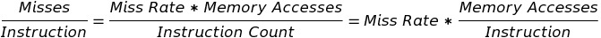

# Memory Hierarchy
### 1. Incentive of using memory hierarchy  
The increasing gap between the performance of CPU and memory
### 2. Designers' target
Traditionally, the average memory access time. For PMD, power efficiency is more important.
### 3. When to write cache data into memory
**Write through** VS **Write back**
### 4. Categories of cache misses
- Compulsory
- Capacity
- Conflict
- Coherency

### 5. Relationship between miss rate and misses per instruction

